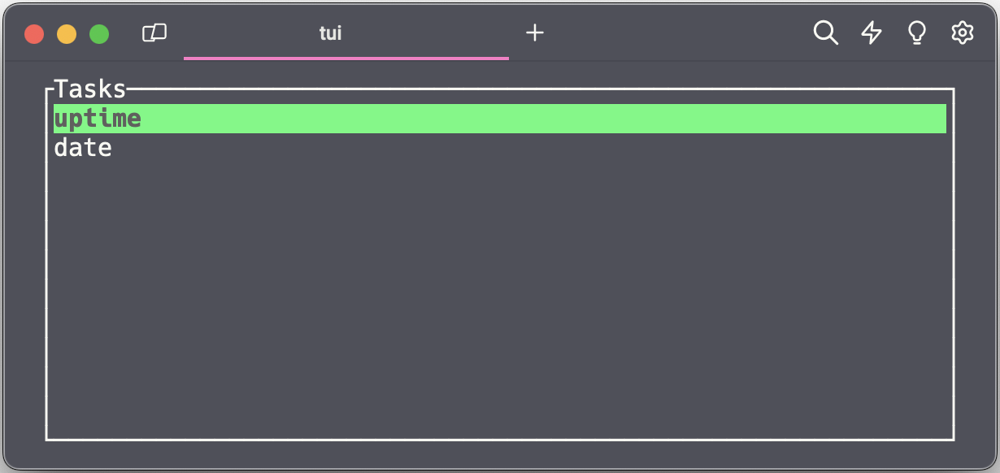

# TaskUI - Simple Terminal UI for Task / taskfile.dev

TaskUI is a lightweight terminal user interface for executing tasks defined using [taskfile.dev](https://taskfile.dev). It provides an easy way to navigate through tasks using arrow keys or Vim-like shortcuts.



## Installation

1. Clone the repository:

```bash
git clone https://github.com/thmshmm/taskui.git
```

2. Build the binary

```bash
cd taskui
cargo build --release
```

3. Create a shell alias for easy access:

```bash
alias tui="/path/to/taskui"
```

## Usage

- Run `tui` in your terminal to launch TaskUI.
- Navigate through tasks using arrow keys `up` and `down`, or use `j` and `k` to move.
- Press `Enter` to execute the selected task.
- Press `q` to exit the program without executing a task.

## Example Taskfile.yml

```yaml
version: '3'

tasks:
  uptime:
    cmds:
      - uptime
  date:
    cmds:
      - date
```

## Contributing

If you have any suggestions, improvements, or bug fixes, feel free to open an issue or submit a pull request.

