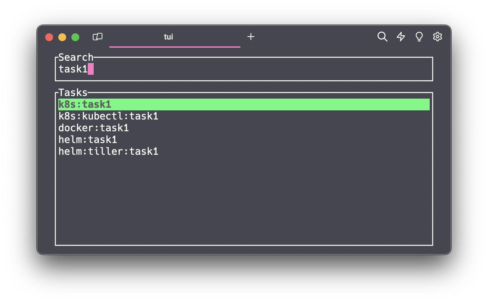

# TaskUI - Simple Terminal UI for Task / taskfile.dev

TaskUI is a lightweight terminal user interface for executing tasks defined using [taskfile.dev](https://taskfile.dev). It provides an easy way to navigate through tasks using arrow keys or Vim-like shortcuts.

Current features are task `execution`, `search` and `preview`.



## Usage

- Navigate through tasks using arrow keys `up` and `down`, or use `j` and `k` to move.
- Press `Enter` to execute the selected task.
- Press `q` to exit the program without executing a task.
- Press `/` to toggle the search bar. Use `Esc` to reset the search or `Enter` to get back to selection mode.
- Press `p` to toggle the preview of a selected task. Use `p` again or `q` to close the preview.

## Configuration

TaskUI can be configured using environment variables.

Available configuration options are:

| Environment Variable | Description | Default |
|----------------------|-------------|---------|
| `TASKUI_LIST_INTERNAL` | Show internal tasks in the task list | `false` |

## Installation

1. Clone the repository:

```bash
git clone https://github.com/thmshmm/taskui.git
```

2. Build the binary

using cargo:

```bash
cd taskui
cargo build --release
```

using Nix:

```bash
nix build
```

3. Create a shell alias for easy access:

```bash
alias tui="/path/to/taskui"
```

## Example Taskfile.yml

```yaml
version: '3'

includes:
  k8s: ./k8s.yml
  docker: ./docker # requires ./docker/Taskfile.yml to exits
  helm:
    taskfile: ./helm.yml
    optional: true

tasks:
  uptime:
    cmds:
      - uptime
  date:
    cmds:
      - date
```

## Contributing

If you have any suggestions, improvements, or bug fixes, feel free to open an issue or submit a pull request.

